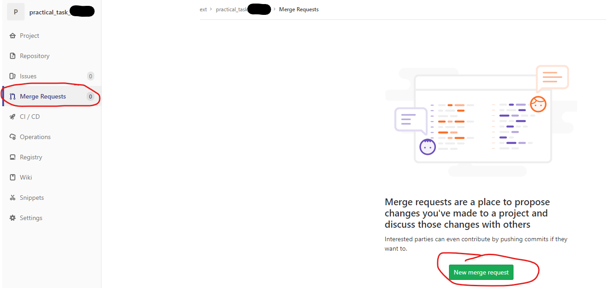

# Practical Task

Practical task/assignment for round 2 of the application for Software Developer

## First steps:
1. setup your access to this git repository by adding your ssh key (top right user icon > Settings > SSH keys) and cloning the repository using the ssh clone link off the `Clone v` button. Should this not work fall back to using the https option.
1. read the remainder of the [task description](task_description/README.md) to understand the scope of the assignment
1. code away in a programming language of Java21 and Spring Boot
1. if possible, given time constraints, deliver your package in a docker image to get it up and running without any additional installation required apart from docker / docker-compose)
1. regularly push your changes to git => generally apply software engineering best practices and interact with this repository as if you were in a day to day work situation.

## General guidelines:
- please perform your work on a branch != main => you can merge back to main when you're done, but development activity is reflected on feature/topic branches ([reference for git-branching](https://nvie.com/posts/a-successful-git-branching-model/))
- if you have any questions do not hesitate to ask us directly
- since you have to perform your work on a branch != main, in case any questions involve discussing code you wrote use gitlabs "Merge Requests" facilities => they offer code review capabilites, which are excellent tools to "talk technical":

- include all meta files relevant to setup your project; Dockerfile, package manager related files (pom.xml, composer.json, package.json, requirements.txt, Gemfile, ..., **including .lock files if applicable**)
