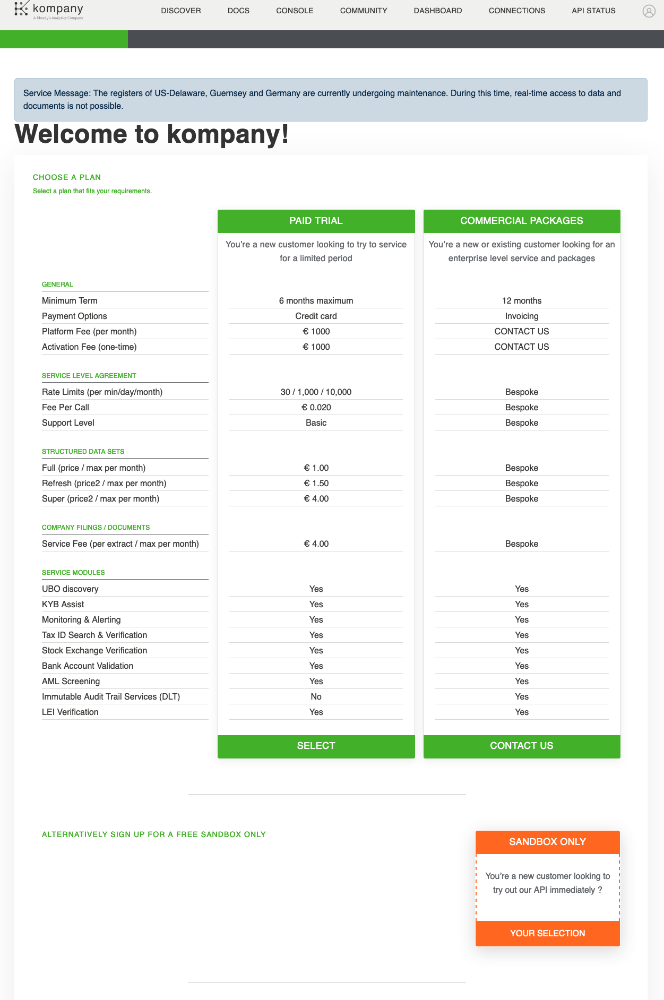
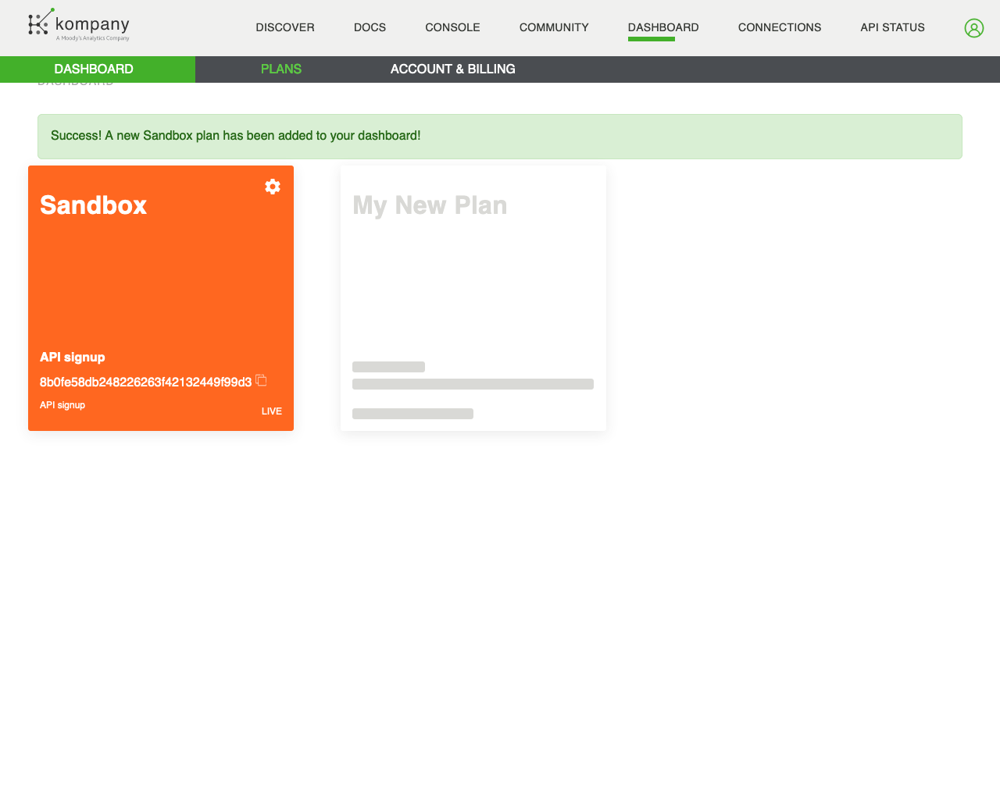
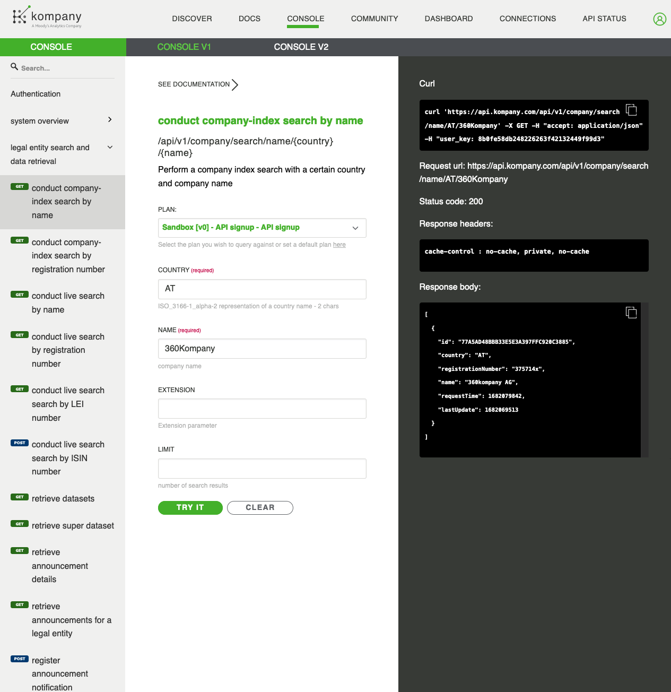

# Context:

One every day activity in Moody's Analytics Austria is to use the low level API and operations
we provide on top of business entities to perform varying tasks for our clients on demand.

One such activity for example is search, identification and matching of official business/corporate entities based on their name. The main challenge of business/corporate entity matching is unique identification based on lackluster and or potentially wrong information (company name changed, registered office address changed etc.).

To ease this process the following operations are vital:
- search for a company by its name and be provided with fuzzily matched companies (name does not have to match precisely)
- get up to date information regarding the identified company (state, name, ...)
- download/purchase specified official documents of a company

# Task description:
Please focus on the primary objectives, only work on the secondary objectives if you have time or get stuck on the primary objectives
- [ ] (pre req) signup for our [Kompany API](https://developer.kompany.com) to obtain an api key (instructions below)
- [ ] (pre req) familiarize with our [API](https://www.kompany.com/kycapi/console) focussing on the operation of "conduct company-index search" (the endpoint is available on the V2 console)
- [ ] (primary) develop a serverside component in **Spring Boot** that handles authentication to the API and exposes company search as an endpoint to the next part of the practical exercise \
  **while testing consider** that the sandbox api key you registered for offers limited access to companies through search, consider the section *"SANDBOX TEST COMPANIES"* of the [technical documentation](https://www.kompany.com/kycapi/docs/resources/resources/customer-facing-documents) (additionally a link directly to the [Sandbox Test Companies](https://www.kompany.com/static/cms-media/2022/05/KYC_API_Sandbox_May2022.pdf))
- [ ] (primary) expose/provide your delivery in the following way:
    - a `Dockerfile` can be built using `docker build -t delivery:latest` (if you need to build several images that's perfectly fine, in that case image name and path will vary of course)
    - **the docker image built needs to be based on a derivative of Linux** => it needs to be possible to run the built image using a Linux based docker hypervisor, no Windows based docker images are permitted for this task
    - the resulting image can be executed/ran using `docker run -itd --rm delivery:latest` (if you need to build several images several run commands are valid as well) exposing 2 ports of choice, one for the serverside component endpoint and another one serving the client side component example
    - if you would like to optimize and streamline the process of building and running your images feel free to make use of `docker-compose` (**preferred**)
- [ ] (secondary) make use of the serverside component to develop and build a client component / web site that is capable of:
  - exposing a search by name (and maybe another parameter - **based on the documentation/endpoints can you think of which one that could be?**)
  - listing the result(s) found by a search
  - You can use any frameworks of your choice (or work without a framework)

# API signup:
1. go to https://www.kompany.com/kycapi/plans/choose and select "SANDBOX ONLY" (the orange box after the plans)
    
1.  fill the form and submit it:
    
1. once you signed, you can go to the [dev portal console](https://www.kompany.com/kycapi/console) and start using the API
   